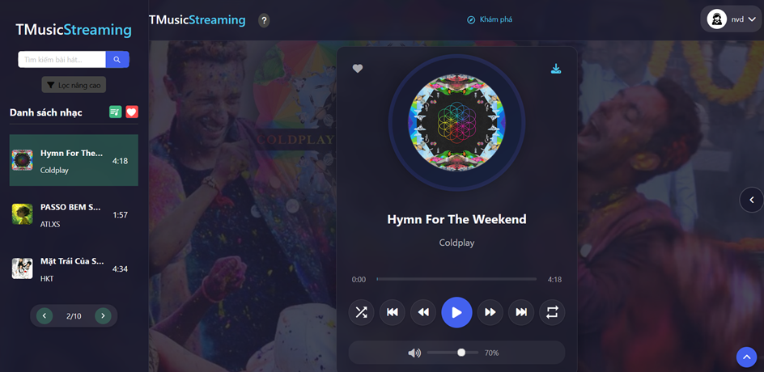
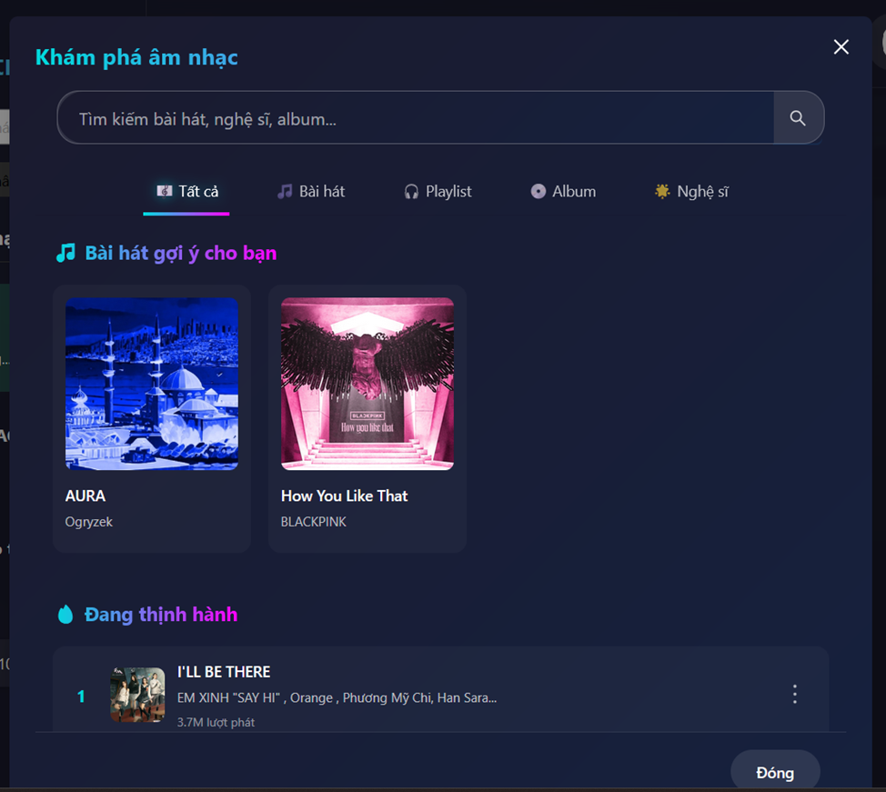
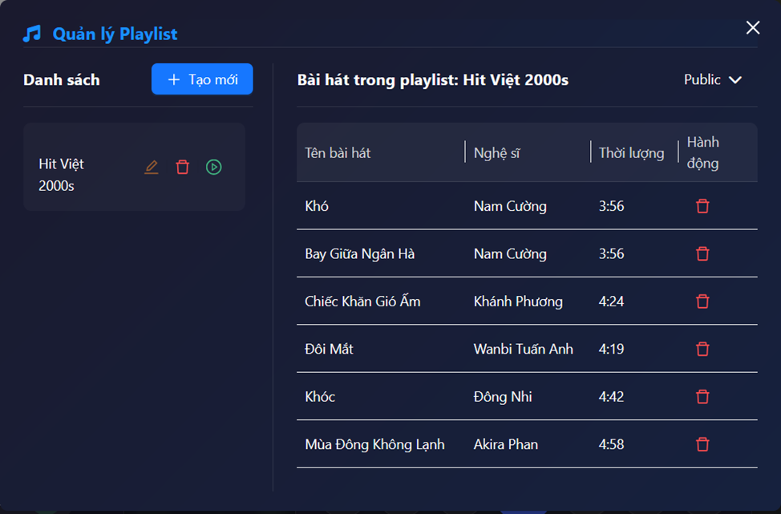
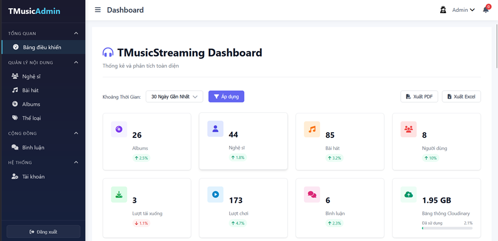
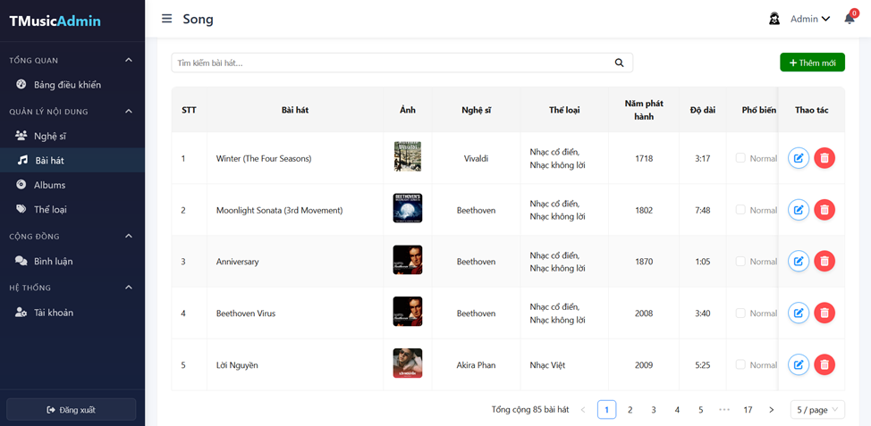

# 🎧 Vue TMusicStreaming

This is the frontend of **TMusicStreaming**, a modern music streaming web app built using **Vue 3**, **Vite**, and **Pinia**. It connects with the ASP.NET Core backend to provide a full-featured experience for listening, managing playlists, and discovering new songs.

---

## 🚀 Features

- 🎵 Browse and play songs from various genres
- 📁 Create and manage personal playlists
- ❤️ Like, favorite, and comment on songs
- 🧠 Personalized song recommendations via collaborative filtering
- 🔍 Powerful search and filtering
- 🔄 Real-time updates (modals, players, etc.)
- 📱 Responsive UI with smooth transitions

---

## 📁 Project Structure

```
src/
├── assets/         # Images, icons, fonts, etc.
├── components/     # Reusable Vue components (UI elements, widgets)
├── composables/    # Reusable logic with `useXyz()` pattern
│   └── Main/       # Player, playlist, modals, filters, actions...
├── configs/        # App-wide config (e.g. API base URL)
├── layouts/        # Page-level layout wrappers
├── pages/          # Route-level pages (Home, SongDetail, Playlist...)
├── plugins/        # Vue plugins (e.g. toast, i18n, etc.)
├── router/         # Vue Router setup and route guards
├── services/       # API interaction (Axios)
├── static/         # Static data or JSON samples (optional)
├── stores/         # Pinia stores (global state management)
├── App.vue         # Root Vue component
└── main.js         # Entry point to bootstrap the app
```

---

## 🖼 UI Screenshots

> Below are some example screenshots of the TMusicStreaming frontend interface:

<div align="center">
  
  <p><em>Home screen showcasing featured songs and genres.</em></p>
</div>

<div align="center">
  
  <p><em>Modal for discovering songs, artists, playlists, and albums.</em></p>
</div>

<div align="center">
  
  <p><em>Manage personal playlists and add favorite songs.</em></p>
</div>

<div align="center">
  
  <p><em>Overview of the admin dashboard.</em></p>
</div>

<div align="center">
  
  <p><em>Admin interface for managing songs.</em></p>
</div>

<div align="center">
  
  <p><em>Form to add new songs and test preview song.</em></p>
</div>


---

## 🔧 Tech Stack

- **Vue 3** + **Composition API**
- **Vite** for fast builds
- **Pinia** for state management
- **Vue Router** for page navigation
- **Axios** for HTTP requests
- **Modular structure** with `composables/` and `services/`

---

## ⚙️ Environment Variables

Create a `.env` file at the root:

```env
VITE_API_BASE_URL=http://localhost:5000/api
```

> You can also configure `.env.production` for deployment.

---

## 🧪 Run Locally

```bash
# Install dependencies
npm install

# Run dev server
npm run dev

# Build for production
npm run build

# Preview production build
npm run preview
```

---

## 🔁 API Integration

All API requests are handled through the `services/` directory, with Axios configured to use the base URL from `VITE_API_BASE_URL`.

Example usage:
```js
import getSongs from '@/services/getSongs'

getSongs() // Fetch list of songs
```

---

## 🧠 Recommendations & Composables

The recommendation logic is integrated via `useSongRecommendations.js` in the `composables/Main/` folder. Other composables manage state and logic for:

- `usePlayer` — Controls audio playback
- `usePlaylist` — Playlist creation & editing
- `useFilters` — Search/filtering behavior
- `useModals` — Modal control and state
- `useSongActions` — Like, download, favorite...
- `useTour` — Interactive guided tour (optional)
- `useUI` — UI-related behaviors (scroll, loading...)

---

## 🛠 Deployment

You can deploy the frontend to any static hosting provider (e.g. **Vercel**, **Netlify**, **GitHub Pages**, **Render static site**):

```bash
npm run build
# Upload /dist to your host
```

---

## 📌 Notes

- Make sure `VITE_API_BASE_URL` points to your deployed backend (ASP.NET Core).
- CORS must be configured properly in backend (`AllowVue` policy).

---

## 📫 Contact

> **Author:** Thinh Huynh  
> **Email:** trthinh2003@gmail.com  
> **GitHub:** [github.com/trthinh2003](https://github.com/trthinh2003)
